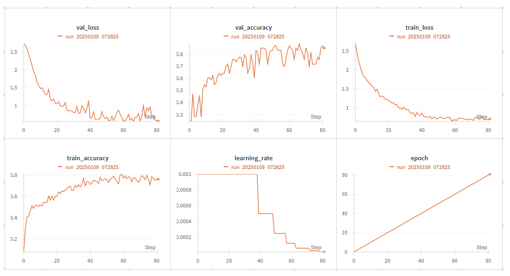

# Human Activity Recognition using STGCN

This project implements a Spatial Temporal Graph Convolutional Network (ST-GCN) for automated exercise recognition and classification. The model leverages deep learning techniques to understand and classify human movements by analyzing the spatial and temporal relationships between key body points during exercise execution. Built with PyTorch, the system processes motion data captured through MediaPipe's pose estimation landmarks, transforming raw spatial coordinates into meaningful movement patterns that enable accurate exercise classification.

The project demonstrates the effectiveness of graph-based deep learning approaches in understanding human motion, where body movements are represented as dynamic graphs evolving over time. This approach allows the model to capture both the spatial configuration of body parts and their temporal dynamics throughout exercise movements, providing a robust foundation for accurate activity recognition in fitness applications.

## Exercise Demonstration
Below is a demonstration of one of the exercises used for training the model. The video shows how the model analyzes continuous movement patterns to recognize specific exercises:


## Data Processing and Loading

The model processes exercise motion data captured through MediaPipe landmarks (key body points) using a sophisticated data preparation pipeline. Raw landmark coordinates are transformed into meaningful sequences using a sliding window approach, where each window contains 64 frames with a stride of 32 frames, creating overlapping segments of motion data. This technique ensures that continuous motion patterns are captured effectively while maintaining temporal relationships between frames.

The data is handled through PyTorch's DataLoader, which provides efficient batch processing rather than loading all data at once. This approach offers several advantages: memory efficiency through batch processing (32 sequences at a time), automatic data shuffling for better training performance, parallel data loading with multiple workers, and optimized GPU memory handling through pin_memory. Each sequence is structured as a three-dimensional array [window_size, n_landmarks, n_features], where n_landmarks represents 8 key body points (shoulders, elbows, wrists, and hips) and n_features contains their x, y, z coordinates. This format is crucial for STGCN as it enables the model to analyze both spatial relationships between body points and their temporal evolution throughout the exercise movement.

### Practical Example
To better understand the sequence creation process, consider a 10-second exercise video recorded at 30 FPS (frames per second), resulting in 300 frames total. With our sliding window configuration (window_size=64 and stride=32), each sequence captures approximately 2.1 seconds of motion (64/30 ≈ 2.1s). The stride of 32 means each new sequence starts halfway through the previous one, creating overlapping windows that ensure smooth motion capture and no missing transitions. This approach transforms our 10-second video into roughly 8 distinct but overlapping sequences, each providing the model with a comprehensive view of the exercise motion while maintaining temporal continuity.

## Training Parameters

- **window_size=64** – Defines the length of the input sequence for the model, determining how much past data is used for predictions.
- **stride=32** – Controls the step size when creating overlapping sequences from the dataset, influencing the number of training samples.
- **batch_size=32** – Specifies the number of samples per batch during training, affecting memory usage and model convergence speed.
- **use_augmentation=True** – Enables data augmentation techniques to enhance model generalization and robustness.
- **test_size=0.2** – Indicates that 20% of the dataset is reserved for validation, ensuring proper performance evaluation.
- **hidden_channels=64** – Sets the number of hidden units in the model, impacting its capacity to learn complex patterns.
- **graph_nodes=8** – Defines the number of nodes in the graph structure, relevant for spatiotemporal graph-based learning.
- **learning_rate=0.001** – Determines the step size for updating model weights, influencing training speed and stability.
- **epochs=100** – Specifies the number of complete passes through the training dataset, affecting model convergence.

## Dateset
We used the dataset which contains 3D positional data of key body joints captured during 16 diffrent exercises. It is designed for tasks such as human activity recognition, pose estimation, and motion analysis.

We downloaded dataset from **CV24/Proj_02/Tematy projektów (Upel)**, and used them in project as landmark.csv and labels.csv.

### Data Structure
Each row represents a single timestamp, with columns corresponding to the x, y, and z coordinates of specific joints:
- Joints Tracked:
    - Left Side: Elbow, Hip, Shoulder, Wrist
    - Right Side: Elbow, Hip, Shoulder, Wrist
- Coordinate System:
    - _x – X-axis position
    - _y – Y-axis position
    - _z – Z-axis position
- Exercise Label:
    - The final column (exercise) represents the performed exercise, which can be used for classification. The -1 label means that the actor is not doing any exercise. Other labels refer to specific exercices.
### Example data
LEFT_ELBOW_x | LEFT_HIP_x |LEFT_SHOULDER_x | LEFT_WRIST_x |...| RIGHT_WRIST_z | exercise
--- | --- | --- | --- |--- |--- |--- 
0.4943 | 0.4354 | 0.4620 | 0.4922 | ... | -0.3369 | -1
0.4920 | 0.4354 | 0.4623 | 0.4919 |... | -0.3182 | 2

## Results Summary

    accuracy                           0.83        53
    macro avg      0.76      0.78      0.76        53
    weighted avg   0.79      0.83      0.80        53



The model achieved an **val accuracy** of **86.79%**. (train accuracy 76.42%)

Precision and recall are high for most classes, with F1-scores of 1.00 for many classes. In a few classes (e.g., -1, 9, 14), precision, recall, and F1-score are all 0.00, indicating that the model did not predict any examples for these classes. It is important to note that these classes only have 1 or 2 samples in the test set, which may explain this result. These classes could be difficult to predict due to their limited representation. \
The average **precision** (0.76), **recall** (0.78), and **F1-score** (0.76) indicate a good balance in the model's performance across all classes. The weighted averages are higher, at 0.79, 0.83, and 0.80 respectively, which naturally suggests that the model performs better on classes that appear more frequently in the dataset.

The model demonstrates high efficiency, especially for classes that appear more frequently in the dataset. To improve the results, increasing the representation of classes with fewer samples should be considered. Additionally, class weighting during training could be explored to make the model pay more attention to underrepresented classes.

## Running Instructions

To run the project, follow these steps:

1. Install the required libraries:
pip install -r requirements.txt

2. Run the data-exploration.ipynb notebook to explore and save data
for the model.

3. Run the model training by executing the st_gcn.py script.

By default, training logs are tracked using Weights & Biases (wandb):
```console
python src/model/st_gcn.py
```

To disable wandb logging, run:
```console
python src/model/st_gcn.py --use_wandb=False
```
